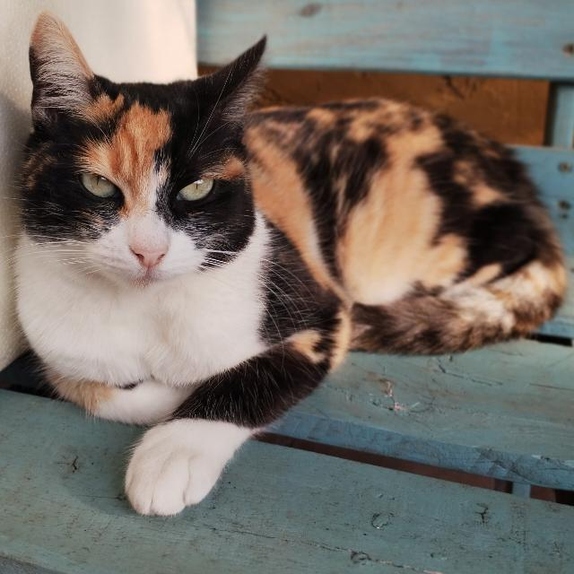

# Programación con objetos I
## Presentación Personal
Un gusto, mi nombre es Iván Blanco, tengo 23 años y actualmente estoy cursando el segundo año en la tecnicatura de programación de videojuegos.
Desde chico le tome el gusto a todo lo relacionado a la tecnología, pero sobre todo a las computadoras y a los videojuegos, por lo que mi objetivo sería poder vivir de desarrollar videojuegos. Para terminar la presentación y aprovechando que no tengo una foto mía a mano, dejo una foto de mi gata.

### Datos Personales
- Mi nombre es: Iván Blanco Cangiano
- Vivo en: Villa Luzuriaga 

### Otra Información
- Actualmente tuve algunos contactos previos con github, una parte del taller de vibe coding de la universidad y otra parte porque muchos desarrolladores de videojuegos usan github para publicar las diferentes builds/versiones de sus juegos.
- La gata de la foto se llama Athenea.
